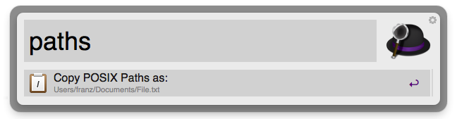
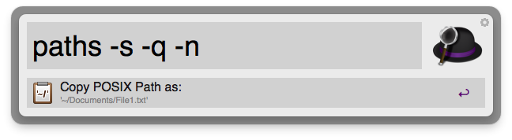
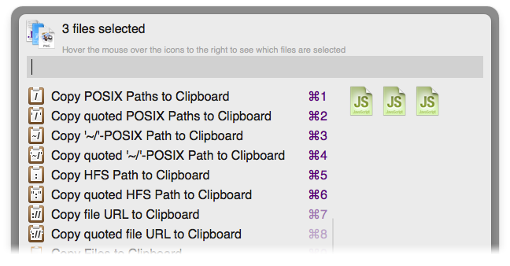

# Copy Paths to Clipboard

Workflow for Alfred 2 and 3 to copy the paths of your current files and Documents to the clipboard in a variety of formats: 

* POSIX, HFS paths and file URLs
* '~/'-shortened POSIX paths
* quoted paths
* comma- or newline-separated.

All options (except newline-separation) are available as File Actions also.

## Usage

Invoke the scriptfilter by typing **`paths`**. If you are in Finder, the path(s) of your current Finder item(s) or selection will be copied to the clipboard, if you're in an other (document-based) application the path of your frontmost document will be copied. The scriptfilter will give you feedback as to how exactly your path will be copied upon actioning your input in the subtitle.

### Options

By default and without using any of the options, paths will be copied as as-is slash-delimited POSIX paths:

	/Users/UserName/Documents/File.txt

**`-hfs`** copies your path as an HFS path.
	
	Macintosh HD:Users:UserName:Documents:File.txt
	
**`-url`** copies url-encoded file urls

	file:///Users/franz/Documents/File.txt

**`-s`** '~/'-shortens paths under user home. Applies to POSIX paths only.

	~/Documents/File.txt

**`-q`** copies paths with quotes. 
POSIX paths will be quoted using single quotes. 	

	'/Users/UserName/Documents/File.txt'
	
HFS paths will be quoted using double quotes with **`-q`**.

	"Macintosh HD:Users:UserName:Documents:File.txt"

**`-n`** will put each path on a new line if you have multiple paths. 

	/Users/UserName/Documents/File1.txt
	/Users/UserName/Documents/File2.txt

By default, multiple paths will be comma separated.

	/Users/UserName/Documents/File1.txt, /Users/UserName/Documents/File2.txt
	
All options can be combined.
The scriptfilter subtitle will update the path as it will be copied as per your current options (if you're using **`-n`**, obviously only the first path will be visible)

### File Actions

This Workflow also adds File Actions for all the options above except newline-separation. Each of these File Actions accept multiple items (use [alt]-[arrow-up] to add an item to your selection, [alt]-[arrow-right] to display File Actions for your selection of multiple items).

### Changelog

###### ***June 17, 2015***

Merged two PRs:
* Add missing leading slash to POSIX paths
* Fix unicode paths

###### ***November 15, 2014***

Add option to copy as file urls, update icons to be slightly more Yosemite-like, change hfs option to '-hfs' (incl. the leading hyphen) to be consistent with the other options

###### ***August 23, 2014***

Improve stability for applications other than Finder

###### ***June 18, 2013***

Add support for paths containing non-ASCII/Unicode characters in the scriptfilter (use quoted option `-q` if you're copying such paths for the Terminal)

## License

### The MIT License (MIT)

Copyright (c) 2013 - 2014 Franz Heidl

Permission is hereby granted, free of charge, to any person obtaining a copy
of this software and associated documentation files (the "Software"), to deal
in the Software without restriction, including without limitation the rights
to use, copy, modify, merge, publish, distribute, sublicense, and/or sell
copies of the Software, and to permit persons to whom the Software is
furnished to do so, subject to the following conditions:

The above copyright notice and this permission notice shall be included in
all copies or substantial portions of the Software.

THE SOFTWARE IS PROVIDED "AS IS", WITHOUT WARRANTY OF ANY KIND, EXPRESS OR
IMPLIED, INCLUDING BUT NOT LIMITED TO THE WARRANTIES OF MERCHANTABILITY,
FITNESS FOR A PARTICULAR PURPOSE AND NONINFRINGEMENT. IN NO EVENT SHALL THE
AUTHORS OR COPYRIGHT HOLDERS BE LIABLE FOR ANY CLAIM, DAMAGES OR OTHER
LIABILITY, WHETHER IN AN ACTION OF CONTRACT, TORT OR OTHERWISE, ARISING FROM,
OUT OF OR IN CONNECTION WITH THE SOFTWARE OR THE USE OR OTHER DEALINGS IN
THE SOFTWARE.

